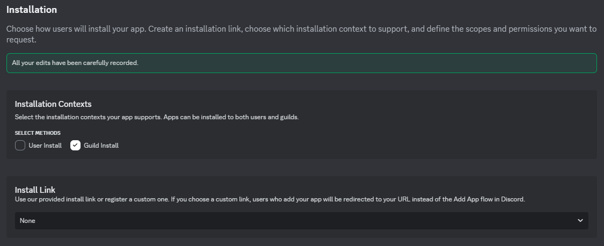

# Quickstart

## Requirements

* **A Database & Cache**: Use **Valkey** or **Redis** for caching (we use Valkey in this guide). The main database must be **PostgreSQL**.
* **Server**: A server or computer to host the bot, preferably running Linux.
* **Skills**: Basic knowledge of the command line and managing servers.
* **Permissions**: The **Manage Server** permission in the Discord server where you want to add the bot.
* **Discord Developer Dashboard** access.
* A Discord account (obviously).

## Step 0: Chose Your Hosting Method

You can either choose to host everything yourself, or you can use a cloud provider to hose everything for you.


We recommend hosting everything in the cloud since it's easier for beginners. However, if you have a spare computer or server and the knowledge to host it yourself, we suggest you do that since its cheaper than paying a cloud provider to host it all for you.


## Step 1: Basic Setup and Preparation

After deciding on how you want to host the bot and its resources, move onto the basic setup and preparation outlined below.



#### Navigate to the Discord Developer Dashboard

[Click this link](https://discord.com/developers/applications) and sign into your discord account. Once you sign in, you should see a page like this:

<figure><figcaption>
Discord Developer Dashboard Applications Page
</figcaption></figure>

This is what's known as your applications page. This is where you'll see and manage all of your Discord bots and applications.



#### Create a new application

Click the button that says, "New Application".

<figure><figcaption>
Create a New Application
</figcaption></figure>

After clicking the button, give you Discord Bot a name, click the check box, and then click "Create".

<figure><figcaption>
Create Application Dialogue
</figcaption></figure>

Once you click the "Create" button and complete the CAPTCHA, you should see a page like this:

<figure><figcaption>
Discord Application Overview Page
</figcaption></figure>

This is the overview page for your Discord bot. Here, you can configure the app icon, the app name, and app description.



#### Invite the bot to your server

In the left navigation pane, click the button that says, "OAuth2".

<figure><figcaption>
OAuth2 Button
</figcaption></figure>

Once you click the button, you should see a page that looks like this:

<figure><figcaption>
OAuth2 Page
</figcaption></figure>

Underneath the section that says, "Client Information" where it says "Client ID", click on the "Copy" button. Save this number as we'll need it for later.

<figure><figcaption>
Client ID
</figcaption></figure>

Next, scroll down to this section:

<figure><figcaption>
OAuth2 URL Generator
</figcaption></figure>

Check the checkbox next to where it says, "bot". Scroll down. Under the "Bot Permissions" section, click the checkbox for "Administrator" under the "General Permissions" section. Next, scroll down again and for the "Intergration Type" dropdown, make sure it says, "Guild Install". In the end, your configuration should look something like this:

<figure><figcaption>
OAuth2 URL Generator Configuration
</figcaption></figure>

Click "Copy" next to "Generated URL".\\

<figure><figcaption>
Copy Generated URL
</figcaption></figure>

Open a new browser tab, pase in the link, and press <kbd>Enter</kbd>. You should then see a screen where you can invite the bot into a Discord server. Select your Discord server from the dropdown menu and click "continue".


If you don't see the server you want to add the bot to, it's probably because you don't have the **Manage Server** permission in that Discord server


<figure><figcaption>
Invite Discord Bot Dialogue
</figcaption></figure>

On the next screen, click "Authorize" and if prompted, complete multifactor authentication and the CAPTCHA.

<figure><figcaption>
Authorize Discord Bot
</figcaption></figure>

If everything was successful, you should see a success message like the one below.

<figure><figcaption>
Success Message
</figcaption></figure>

The discord bot was successfully added to your selected Discord server. You can now continue with the rest of the guide.



#### Configure installation settings

Click the button on the left navigation pane that says, "Installation".

<figure><figcaption>
Installation Button
</figcaption></figure>

After you click on the button, you'll be greeted by a page that look something like this:

<figure><figcaption>
Installation Page
</figcaption></figure>

First, uncheck the checkbox next to "User Install". Next, select "None" from the "Install Link" dropdown (click where it says "Discord Provided Link"). Finally, click "Save" at the bottom of the screen. When you're done, your screen should look like this:

<figure><figcaption>
Updated Installation Options
</figcaption></figure>

Now, it's time to configure the actual Discord bot.



#### Configure and get your bot's information

Click the button on the left navigation pane that says, "Bot".

<figure><figcaption></figcaption></figure>

After clicking on the "Bot" tab, you'll see a page like this:

<figure><figcaption>
Discord Application Bot Tab
</figcaption></figure>

Here, you can configure things such as the username, banner, and icon of your bot. Scroll down to the section that looks like this:

<figure><figcaption>
Bot Options
</figcaption></figure>

Deselect the "Public Bot" option and choose all other options. Make sure to click "Save". Your screen should resemble this:

<figure><figcaption>
Updated Bot Options
</figcaption></figure>


**Explanation for Selected Options:**

* Unselecting "Public Bot" restricts adding the bot to a server specifically to you, which is our intention.
* Enabling "Requires OAuth2 Code Grant" ensures the bot receives all its permissions before entering your server.
* By selecting all options under "Privileged Gateway Intents," the bot can view member presence statuses, manage members, and access message content.


Next, scroll back up to this section:

<figure><figcaption>
Basic Bot Configuration and Token Options
</figcaption></figure>

Underneath the "Token" header, click on the button that says, "Reset Token".

<figure><figcaption>
Reset Token Button
</figcaption></figure>

Click "Yes, do it!" on the dialogue that pops up.

<figure><figcaption>
Reset Bot Token Dialogue
</figcaption></figure>

Follow the multifactor authentication steps, and once complete, you should see a screen like this:


**WARNING: DO NOT SHARE YOUR BOT TOKEN WITH ANYONE. Treat your bot token like a password. If someone gets access to your bot's token, they'll have unrestricted access to your bot and Discord server, meaning they can do anything that they want. Store this token in a safe place as you won't get to see it again and will have to regenerate it.**


<figure><figcaption>
Discord Bot Token
</figcaption></figure>

Copy your bot token and save it somewhere safe. We'll need it later.



#### Gather other information

If you've made it this far without getting lost, give yourself a pat on the back. Before we move onto the fun stuff, we have to gather one some last bits of information from our Discord server.

Head on over to [Discord](https://discord.com/app) and click on the settings icon next to your username.

<figure><figcaption>
Settings Icon
</figcaption></figure>

Next, scroll down on the left navigation pane and click "Advanced".

<figure><figcaption>
Advanced Settings Button
</figcaption></figure>

Find the option that says, "Developer Mode" and turn that on. Once you are done, your screen should look like this:

<figure><figcaption>
Developer Mode Toggle Turned On
</figcaption></figure>

Exit settings and navigate to your Discord server. On the left server selector pane, right click on your Discord server and click the "Copy Server ID" button on the bottom of the options menu. This is what's known as your "Guild ID". Save this ID as we'll need it later.

<figure><figcaption>
Copy Server ID Button
</figcaption></figure>

Next, in your Discord server, right click on your logs channel and click the "Copy Channel ID" button. Repeat this for your welcome channel.

<figure><figcaption>
Copy Channel ID Button
</figcaption></figure>

Lastly, click on your server's name at the top and click on "Server Settings".

<figure><figcaption>
Server Settings Button
</figcaption></figure>

Then, click on the "Roles" button in the left navigation pane and find the role(s) that you want to assign to people as soon as they join your server. Right click on each role and select "Copy Role ID". Save these ID's as we'll need them later when configuring the bot.

<figure><figcaption>
Copy Join Role ID
</figcaption></figure>

We are now done with the preparation for our Discord bot. It's now time to setup and deploy the Discord bot and its services. Based on your decision in Step 0, click on the corresponding link to take you to the rest of the quick start guide.




[self-hosting.md](self-hosting.md)



[using-a-cloud-provider.md](using-a-cloud-provider.md)

